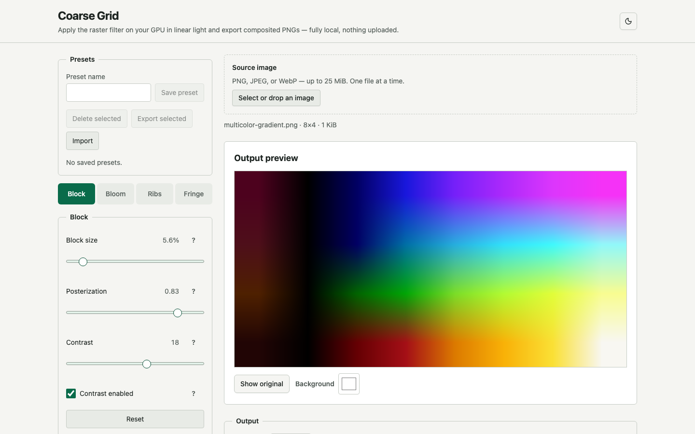
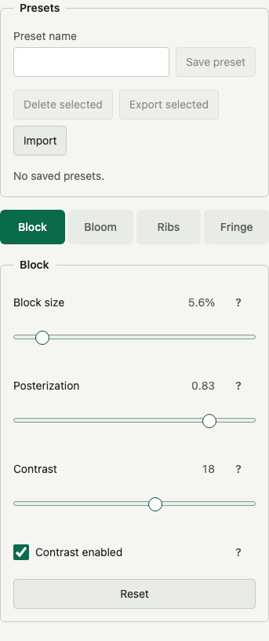

# Coarse Grid

Coarse Grid turns a photo into a coarse block-grid raster artwork in your browser, on the GPU. Drop in a PNG, JPEG, or WebP, tune the block, bloom, ribs, and RGB fringe controls, and export a transparent PNG. Everything runs locally in your browser through a WebGL2 pipeline backed by `regl`; no image ever leaves your machine.

This tool is an homage to **Jacqueline Casey**, the pioneering Swiss-style graphic designer at MIT, and to her 1979 recruitment poster for MIT Lincoln Laboratory. That poster reduces a crowd of faces to a bold grid of coarse blocks, finding rhythm and motion in geometry. Coarse Grid borrows the same instinct: take a photograph and rebuild it as a grid of weighted blocks, lit and textured with luminance-responsive ribs and RGB fringe. You can see the original poster that inspired this project [here](https://www.instagram.com/p/DJ-BDYSIspE/).



## Screenshots

The hero screenshot above shows the desktop workbench at 1440×900 with a source image rendered through the default filter. The mobile view below shows the expert controls panel at a 375px-wide viewport.



## Quick start

Requires Node.js >= 22.18 (the `engines` requirement) and pnpm (enable it once with `corepack enable`, or install it with `npm i -g pnpm`).

```sh
corepack enable
pnpm install
pnpm run dev
```

The dev server runs at `http://127.0.0.1:4173` by default. For a production bundle and preview:

```sh
pnpm run build
pnpm run preview
```

Opening `index.html` directly over `file://` is not supported. Serve the app through Vite.

## Install the core package

The GPU engine behind Coarse Grid is published as `@voyager-fm/coarse-grid-core` on GitHub Packages, so you can reuse the renderer in your own project without cloning this monorepo. Prefer to see it running first? The full app is live on GitHub Pages at [https://voyager-fm.github.io/coarse-grid/](https://voyager-fm.github.io/coarse-grid/).

GitHub Packages requires authentication even for public packages. Create a classic personal access token with the `read:packages` scope, or rely on the built-in `GITHUB_TOKEN` in CI. Then point the `@voyager-fm` scope at the registry in your project's `.npmrc`:

```ini
@voyager-fm:registry=https://npm.pkg.github.com
//npm.pkg.github.com/:_authToken=YOUR_GITHUB_TOKEN
```

Install the package:

```sh
npm install @voyager-fm/coarse-grid-core
```

## Usage

1. Select or drop a single PNG, JPEG, or WebP file.
2. Adjust posterization, block size, contrast, bloom, ribs, and RGB fringe in the expert controls. Every edit updates the preview in real time.
3. Explore the edit history with undo (Ctrl+Z) and redo (Ctrl+Shift+Z).
4. Reuse settings by saving, loading, exporting, and importing presets.
5. Toggle the original/result comparison to see the effect before and after.
6. Choose an output scale and export a transparent PNG.

The filter and output controls stay disabled until an image is uploaded; the help buttons remain usable. Uploading a new image or resetting to defaults returns every expert control to the default values below.

## GPU rendering architecture

The renderer explicitly creates a WebGL2 context, requires the `EXT_color_buffer_float` extension, and only enables rendering after passing a 1×1 RGBA32F framebuffer probe. It hands a WebGL2 context to regl 2.1.1 and runs fullscreen-triangle passes with depth, stencil, and blending disabled. The renderer is unavailable, and upload, render, and export stay disabled, unless all of the following hold:

- the browser supports a `webgl2` context,
- the `EXT_color_buffer_float` extension is available,
- an RGBA32F texture created with `regl.texture({format:'rgba',type:'float',min:'nearest',mag:'nearest',wrap:'clamp'})` reports `FRAMEBUFFER_COMPLETE` when attached to a depthless, stencilless framebuffer.

Rendering runs in six stages:

1. **Fullscreen vertex.** With depth, stencil, and blending disabled, one triangle spanning normalized coordinates `[-1,-1]`, `[3,-1]`, and `[-1,3]` is drawn. The fragment shader reads `gl_FragCoord` directly as pixel coordinates.

2. **Straight linear source.** The image is decoded with the orientation the browser applied, and top-left-origin RGBA8 pixels are read from a same-size Canvas2D. These pixels are held in one linear-sampled RGBA8 source texture in normalized coordinates. An upload pass samples that texture at the current target resolution, converts sRGB input to linear light, and keeps alpha intact. At this stage Canvas2D is used only for orientation-correct decoding and the final PNG encoding.

3. **Tile sum.** A pre-reduction pass active only when the block size exceeds 16px. Each 16×16 tile writes the accumulated linear RGB × alpha sum and the alpha sum for that tile into an RGBA32F texture, so large blocks reduce efficiently without being sampled many times.

4. **Exact block reduction.** When the block size is 16px or less, the original scene is walked directly, accumulating each pixel's linear RGB weighted by alpha. When the block size exceeds 16px, the tile-sum texture is read so fully contained tiles reuse their sums and only boundary tiles are walked directly. The final output is the alpha-weighted average linear color `sum(RGB × alpha) / sum(alpha)` and the block-average alpha `sum(alpha) / blockArea`, where `blockArea` is the block's area clipped to the image so edge blocks of fully opaque images stay fully opaque. Blocks with zero alpha output `(0, 0, 0, 0)`.

5. **Photo-adaptive post-processing.** Contrast, posterization, bloom, ribs (HSV value and saturation scaling), and RGB fringe (source- and block-based RGB separation plus rib-phase tint) are applied to the block colors in linear light. Rib colors are generated by scaling the block's HSV value and saturation by their respective scales. The output alpha channel is the block-average alpha, so transparent-background silhouettes are quantized to the block grid instead of keeping per-pixel anti-aliased edges. The final output is encoded to sRGB, and fully transparent pixels stay `(0, 0, 0, 0)`.

6. **Preview display.** The finished result is blitted to the display canvas. The `showOriginal` flag chooses the original source texture or the filtered result, composited against the background color and alpha. Export reads a dedicated RGBA8 FBO, flips the bottom-left-origin `readPixels` rows once, and hands a zero-copy `Uint8ClampedArray` view of the same buffer to Canvas2D `ImageData` for PNG encoding.

Transparent input pixels and alpha blending are preserved through block reduction and post-processing. The exported PNG is straight-alpha transparent sRGB output with an alpha channel. Block reduction, luminance, contrast, posterization, bloom, ribs, and fringe all compute in linear light.

### Block size and coordinates

Block size is an integer pixel value computed per target image as `max(1, round(min(width, height) × blockPercent / 100))`. A 200% export therefore uses proportionally larger blocks.

Spatial parameters (rib pitch, rib widths, rib edge softness, fringe distance, fringe probe distance, and fringe rib edges) are defined in logical units (`lu`). `computeLogicalScale(width, height)` returns the shorter side divided by 1000 as the scale, and `convertLogicalToTargetPixels(params, targetWidth, targetHeight)` converts `lu` values to target pixels with that scale. The same `lu` values therefore produce proportionally identical visual effects at every output resolution.

Image coordinates use a top-left origin where `(0, 0)` is the top-left pixel of the uploaded image. A rib angle of `0°` is vertical; positive angles rotate the rib normal clockwise in the top-left coordinate system. Out-of-image scene or block samples return black `(0, 0, 0)`.

## Expert controls

The table below is the complete set of current `CONTROL_DEFINITIONS`. Colors are opaque sRGB and are converted to linear light before shader use. Toggle defaults marked "on" are `true`. The spatial unit `lu` is a logical unit proportional to the target resolution's shorter side divided by 1000.

| Control | Range and step | Default | Description |
| --- | --- | --- | --- |
| Block size | 1 ~ 50%, 0.1% | 5.6% | Block size as a percentage of the target image's shorter side. Recalculated for each export size. |
| Posterization | 0 ~ 1, 0.01 | 0.83 | Skips quantization at 0. Higher values reduce the number of saturation and value steps. |
| Contrast | -100 ~ 100, 1 | 18 | Contrast applied in linear light before block samples are averaged. |
| Contrast enabled | toggle | on | Turns the pre-reduction contrast adjustment on or off. |
| Bloom | 0 ~ 1, 0.01 | 0.12 | Strength of the four-way glow around bright blocks. |
| Bloom enabled | toggle | on | Turns the bloom step for bright areas on or off. |
| Bloom highlight low | 0 ~ 1, 0.001 | 0.35 | Linear luminance where the bloom highlight gate begins. |
| Bloom highlight high | 0 ~ 1, 0.001 | 0.82 | Linear luminance where the bloom highlight gate fully opens. |
| Rib angle | 0 ~ 180°, 1° | 0° | 0° is vertical; larger values rotate the rib direction. |
| Rib pitch | 2 ~ 64 lu, 0.25 lu | 16 lu | Logical-unit (lu) spacing between rib centers. |
| Low-luminance rib width | 0 ~ 16 lu, 0.05 lu | 1 lu | Rib width (lu) applied in low-luminance regions. |
| High-luminance rib width | 0 ~ 16 lu, 0.05 lu | 2.25 lu | Rib width (lu) applied in high-luminance regions. |
| Low-luminance darkness | 0 ~ 1, 0.01 | 0.45 | Darkness of ribs in low-luminance regions. |
| High-luminance darkness | 0 ~ 1, 0.01 | 0.65 | Darkness of ribs in high-luminance regions. |
| Low-luminance value scale | 0 ~ 2, 0.01 | 0.52 | Source-relative scale of rib value in low-luminance regions. |
| High-luminance value scale | 0 ~ 2, 0.01 | 0.72 | Source-relative scale of rib value in high-luminance regions. |
| Low-luminance saturation scale | 0 ~ 2, 0.01 | 0.90 | Source-relative scale of rib saturation in low-luminance regions. |
| High-luminance saturation scale | 0 ~ 2, 0.01 | 1.05 | Source-relative scale of rib saturation in high-luminance regions. |
| Luminance low | 0 ~ 1, 0.001 | 0.45 | Linear luminance where the high-luminance rib response begins. |
| Luminance high | 0 ~ 1, 0.001 | 0.88 | Linear luminance where the high-luminance rib response fully applies. |
| Luminance gamma | 0.1 ~ 4, 0.05 | 1.25 | Exponent of the rib luminance response curve. |
| Rib edge softness | 0 ~ 4 lu, 0.05 lu | 0.65 lu | Transition width (lu) of each rib edge. |
| Ribs enabled | toggle | on | Turns the luminance-responsive rib transform step on or off. |
| Fringe distance | 0 ~ 8 lu, 0.05 lu | 0.75 lu | Logical-unit (lu) offset of the opposing red and blue samples. |
| Fringe probe distance | 1 ~ 32 lu, 0.25 lu | 10 lu | Logical-unit (lu) offset used for edge detection. |
| Fringe intensity | 0 ~ 2, 0.01 | 0.32 | Contribution of the RGB separation effect. |
| Fringe tint mix | 0 ~ 1, 0.01 | 0.08 | Blend amount of cyan or magenta fringe tint. |
| Edge low | 0 ~ 1, 0.0001 | 0.01 | Value where the fringe edge gate begins. |
| Edge high | 0 ~ 1, 0.0001 | 0.04 | Value where the fringe edge gate fully opens. |
| Rib edge low | 0 ~ 4 lu, 0.05 lu | 0.35 lu | Value (lu) where the fringe rib-edge gate begins. |
| Rib edge high | 0 ~ 4 lu, 0.05 lu | 1.20 lu | Value (lu) where the fringe rib-edge gate fully opens. |
| Minimum rib-edge contribution | 0 ~ 1, 0.01 | 0.15 | Fringe contribution kept even outside rib edges. |
| Block fringe gain | 0 ~ 3, 0.05 | 0.90 | Gain applied to block RGB separation. |
| Negative fringe tint | opaque sRGB color | `#00C7FF` | Cyan-family tint applied to negative rib phase. |
| Positive fringe tint | opaque sRGB color | `#FF1475` | Magenta-family tint applied to positive rib phase. |
| RGB fringe enabled | toggle | on | Turns the RGB separation and phase-tint step on or off. |

Rib colors are no longer a fixed color pick. They are generated from the rib-center block's HSV color by scaling value and saturation with their respective scales, interpolated between the low- and high-luminance bands by the luminance response. The darkness values are the blend strength between this rib color and the scene color.

`Posterization` quantizes saturation and value in HSV color space, splitting them into `exp2(mix(8, 2, posterization))` steps: `0` does no quantization, `1` quantizes maximally.

`Bloom highlight high` must be greater than `bloom highlight low`, `luminance high` greater than `luminance low`, `edge high` greater than `edge low`, and `rib edge high` greater than `rib edge low`. Edited values outside these relations are normalized to the nearest valid value. The bloom four-neighbor kernel, the exact alpha-weighted average in block reduction, and the fringe gate expressions are fixed shader contracts, not controls.

## Upload and export limits

| Item | Limit |
| --- | --- |
| Input formats | PNG, JPEG, WebP |
| Selection | One file at a time |
| File size | Up to 25 MiB |
| Decoded input | Up to 16,000,000 pixels, one side up to 8,192 px |
| Export | Up to 8,000,000 pixels, one side up to 16,384 px |

Output scales are `25%`, `50%`, `75%`, `100%`, `125%`, `150%`, and `200%`, defaulting to `100%`. Target dimensions are `max(1, round(original dimension × scale / 100))`. Preview and export share the same GPU upload, composite, reduction, and post-processing pipeline; only the target resolution differs. The preview renders at the selected export scale's target resolution, so what you see in the preview is what exports. There is no Canvas2D target resampling and no upscaling of the preview or a prior result.

The exported PNG is straight-alpha transparent sRGB output. Fully transparent pixels are preserved as `(0, 0, 0, 0)`. The 100% filename is `<stem>-grid.png`; other scales use `<stem>-grid-<scale>.png`, for example `photo-grid.png` and `photo-grid-200.png`. Exports run one at a time and snapshot the source pixels and normalized controls at the start, so in-progress UI changes do not affect the PNG.

## GPU limits and context recovery

Renderable size is not set by product limits alone. A target must satisfy the per-width and per-height minimums of the browser-reported `MAX_TEXTURE_SIZE`, `MAX_RENDERBUFFER_SIZE`, and `MAX_VIEWPORT_DIMS`, intersected with the target block FBO size. Upload and each export target check this GPU limit together with the product limit and confirm the required FBO is complete. The 8,000,000-pixel and 16,384px-per-side product maximums must therefore also satisfy the real GPU capabilities and successful memory allocation. Scales beyond the limit are disabled, and a re-checking export reports an inline error.

When editing `blockPercent` changes the block size or grid, a new block FBO is created first, swapped in only on success, then the previous FBO is released. Before export the preview intermediate FBO is released, the export FBO is used, and the current preview is rebuilt. This bounds peak GPU memory while keeping the retained source texture. There is no CPU fallback for WebGL2 init failure, a missing `EXT_color_buffer_float`, an RGBA32F probe failure, GPU allocation failure, an incomplete FBO, or an over-size GPU target. Existing valid source, preview, and controls are never replaced by a failed new upload or render. On `webglcontextlost` pending renders and exports are cancelled and GPU operations are disabled. On recovery, regl context and commands are rebuilt, capability values and the `EXT_color_buffer_float` and RGBA32F probes are re-run, the source texture and FBOs are rebuilt from the retained RGBA8 pixels, and the current preview is rendered. GPU operations re-enable only when the new capability checks and allocations succeed.

## Determinism, browsers, and privacy

Repeated renders and exports with the same source pixels, target dimensions, and controls must produce identical RGBA8 bytes within a supported browser. Byte identity across browsers is not required; the acceptance bar is the same block layout, rib direction, fringe placement, and transparent-alpha structure, with RGB absolute channel error at most 4 on average and 20 at the 99th percentile.

Current stable Chrome, Firefox, and Safari are supported where they provide WebGL2 and `EXT_color_buffer_float`. Browsers without WebGL2 or `EXT_color_buffer_float`, or environments that fail the RGBA32F framebuffer probe, cannot run the GPU raster filter. Playwright's WebKit project is an automation target that checks WebKit-engine coverage, not a literal substitute for the real Safari browser.

Image files and pixels are never uploaded or transmitted to an external server. There are no external APIs, telemetry, or analytics requests. LocalStorage is used only to save presets and never stores image data or sensitive information. Apart from the local Vite requests that serve the app shell, the normal upload, preview, and export flow makes no network requests with image data.

## Workspace layout

Coarse Grid is a pnpm workspaces monorepo with two parts:

- **Root app** (`index.html`, `src/`, Vite build): the React playground. It owns the file upload, the expert-controls editor, presets, the edit-history surface, the preview workspace, and PNG download.
- **`packages/core`** (`@voyager-fm/coarse-grid-core`): the reusable GPU renderer and supporting modules. It exposes the GPU renderer, filter parameter definitions and normalization, edit history, and the preset store, with no UI or DOM of its own.

The core package is organized into six modules:

| Module | Responsibility |
| --- | --- |
| `filter-params.ts` | `CONTROL_DEFINITIONS`, defaults, normalization, size and GPU limit checks, preset serialization |
| `gpu-filter.ts` | regl initialization, textures and FBOs, rendering, export readback, context lifecycle |
| `gpu-shaders.ts` | Fullscreen vertex, upload and linear conversion, post-processing, display blit shaders |
| `gpu-reduction-shaders.ts` | Tile-sum and exact block-reduction shaders (alpha-weighted average) |
| `edit-history.ts` | Immutable edit history (100-state limit, undo/redo) |
| `preset-store.ts` | LocalStorage preset save/load/export/import |

The React app imports this surface from `@voyager-fm/coarse-grid-core` through the workspace symlink, keeping all GPU and parameter logic out of the UI layer.

## Development

The repo is a pnpm workspaces monorepo. See [CONTRIBUTING.md](CONTRIBUTING.md) for setup and contribution guidance. The engine package `@voyager-fm/coarse-grid-core` is TypeScript executed natively by Node during development; `pnpm --filter @voyager-fm/coarse-grid-core build` produces its `dist/` build locally, which is what gets packaged when the core package is published.

```sh
pnpm run check
pnpm run test:unit
pnpm run test:browser
pnpm run test:browser:chromium
pnpm run test:browser:firefox
pnpm run test:browser:webkit
pnpm test
```

`pnpm run check` runs `node --check` over the remaining plain-JavaScript files (browser tests, Playwright config) and then strict `tsc --noEmit` over the app and `packages/core`. `pnpm run test:unit` runs the Node unit tests for control normalization, block sizing and grids, partial block samples, linear-light values, output sizes and filenames, GPU limit intersection, single row flip, shader contracts, preset serialization and validation, and edit history. `pnpm run test:browser` runs the Playwright projects; the individual browser scripts run a single engine. `pnpm test` runs the syntax check, unit tests, production build, and browser tests in sequence.

## Explicit non-goals

CPU filtering and CPU fallback paths, Grid, Dither, legacy Scanline, palettes and duotones, grain, legacy Glow, and legacy RGB shift are not current features. Three.js, direct raw WebGL orchestration, animation, workers, tiling, persistent storage, batch processing, video and animated images, arbitrary output scales, server-side processing, telemetry, and cross-browser byte-for-byte identity are not provided.

## License

Coarse Grid is free software: you can redistribute it and/or modify it under the terms of the GNU General Public License as published by the Free Software Foundation, either version 3 of the License, or (at your option) any later version.

This program is distributed in the hope that it will be useful, but WITHOUT ANY WARRANTY; without even the implied warranty of MERCHANTABILITY or FITNESS FOR A PARTICULAR PURPOSE. See the [GNU General Public License](LICENSE) for details.

You should have received a copy of the GNU General Public License along with this program. If not, see <https://www.gnu.org/licenses/>.
